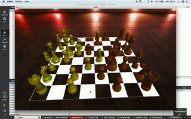

# Chess

A simple chess game implemented with solid

## Attribution

Cubemaps are used from Emil Persson, aka Humus.
http://www.humus.name

# Instructions

Symbolically link the following directories from Huldra Dropbox

You can download then files from here: https://www.dropbox.com/sh/m1htbiaohsktne3/AABzwem4IiLl4gSQug-7biNCa?dl=0

For Unix:

> ln -s ~/Huldra\ Dropbox/Chess/data data

For Windows:

> mklink /D data "..\Huldra Dropbox"\Chess\data

## Instructions for use of the QtCreator (Download from qt.io) qbs build system

Open chess.qbs with QtCreator

Change the run working directory to the following:

> %{sourceDir}/intermediate

Add the following build step before qbs build

For Unix:

> make acp

For Windows, please add /c/Program\ Files/Git/usr/bin to your PATH and use mingw make:

> mingw32-make.exe acp

For this build step, regardless of platform, change the build working directory to the following:

> %{sourceDir}

Also, to Run set the following for working directory (QtCreator does not seem to expand variables here for some reason):

> /Users/username/chess/intermediate
